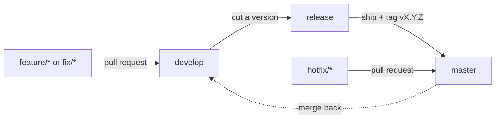

# Contributing

## Branches

| Branch | Purpose |
|---|---|
| `develop` | Default branch. Integration of everything that is ready; pull requests target it |
| `release` | Release candidate: `develop` is merged here when a version is cut; only fixes go in until it ships |
| `master` | Production. Every merge from `release` is tagged `vX.Y.Z` |



- Branch from `develop` as `feature/<short-name>` or `fix/<short-name>`.
- A urgent production fix branches from `master` as `hotfix/<short-name>`, goes into `master` (tagged with a patch version) and is merged back into `develop`.
- Versions follow [Semantic Versioning](https://semver.org/); record changes in `CHANGELOG.md`.
- Commit messages follow [Conventional Commits](https://www.conventionalcommits.org/) (`feat:`, `fix:`, `docs:`, `test:`, `chore:`, `ci:`).

## Before opening a pull request

```bash
python3 -m unittest discover -s tests -t .
```

- Add or update tests for behaviour changes; the standard library only (no new runtime dependencies without a discussion).
- Never commit credentials: `.env` is ignored, use `.env.example` for new variables.
- Keep the feed format backward compatible and update [docs/feed-format.md](docs/feed-format.md) when it changes.
