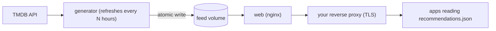

# tmdb_feed_generator

Generates a static JSON feed of **popular movies and series that are available on the streaming services you choose**, using [TMDB](https://www.themoviedb.org/) data (streaming availability by JustWatch). Built for TV home screens and launchers, but the output is plain JSON that any app can read.



- One feed per client/profile, each with its own region, language and list of streaming services.
- A title is only listed if it streams on one of the services you configured, and each card carries the Android package of the app that plays it.
- A failed refresh keeps the last good file; an empty result is never published.
- Python standard library only. Ships with a Docker stack (generator + nginx).

The output format is documented in [docs/feed-format.md](docs/feed-format.md).

## Quick start without a key (demo)

```bash
docker compose -f docker-compose.yml -f docker-compose.demo.yml up --build
curl http://localhost:8080/default/recommendations.json
```

The demo answers from `tests/fixtures` (fake titles and image paths).

## Run it with TMDB

1. Create a TMDB account and an API key at <https://www.themoviedb.org/settings/api>.
2. `cp .env.example .env` and set `TMDB_TOKEN` (the v4 "API Read Access Token" is preferred; the 32-character v3 key also works).
3. Check the provider ids for your region (they differ per country):
   ```bash
   docker compose run --rm generator python -m tmdb_feed_generator list-providers
   ```
   and compare them with `tmdb_feed_generator/providers.py`. The Android package names there were written from memory: confirm each one on a real device.
4. `docker compose up -d --build`

The feed is served at `http://<host>:8080/<client>/recommendations.json`.

Without Docker: `python3 -m tmdb_feed_generator generate --out dist` (reads `TMDB_TOKEN` from the environment or `.env`).

## Clients

One file per client in `clients/<client>.json`; the file name is the client id and the URL path.

```json
{
  "region": "BR",
  "language": "pt-BR",
  "providers": ["netflix", "prime", "disney", "globoplay"],
  "heroCount": 5,
  "rowSize": 12,
  "perProviderRows": true,
  "heroMaxAgeDays": 730
}
```

`heroMaxAgeDays` makes the hero favour titles released in the last N days (most popular first) and fill any remaining slots with the most popular of all time; `0` turns that off.

`providers` is in priority order: when a title streams on several, the first one wins and is the app the card opens. Titles that are on none of the listed services are dropped.

## Hosting

The container serves plain HTTP on port 8080 and exposes only `/<client>/recommendations.json` (everything else is a 404). Put it behind a reverse proxy that terminates TLS, for example:

```nginx
location /feed/ {
    proxy_pass http://FEED_HOST:8080/;
    proxy_set_header Host $host;
}
```

Consumers should read the feed over HTTPS and treat it as untrusted input.

## Security notes

- The TMDB token only lives in the generator container; error messages never include it.
- The generator runs as an unprivileged user with a read-only filesystem and all capabilities dropped.
- Image URLs are only emitted for `https://image.tmdb.org`, and image paths are validated.

## Limitations

- Cards identify the streaming **app**, not the title inside it: deep links into a specific title need agreements with each service, and TMDB does not provide them.
- Provider ids and Android package names must be verified per region and per device.

## Legal and attribution

**Commercial use.** TMDB's terms for the free API say: "The license ... does not permit any commercial use of TMDB, the TMDB APIs, or TMDB Content." Commercial use needs a separate written agreement with TMDB. Read the [API terms of use](https://www.themoviedb.org/api-terms-of-use) and decide whether your use qualifies before you deploy this for a business or for customers.

**Attribution you must show.** Every feed carries the required notice in its `attribution` field, and **apps that display the feed must show it** prominently:

> This product uses TMDB and the TMDB APIs but is not endorsed, certified, or otherwise approved by TMDB. Streaming availability data provided by JustWatch.

- The TMDB logo, if you show it, must be less prominent than your own app's logo and must not imply endorsement. Official logos: <https://www.themoviedb.org/about/logos-attribution>.
- Streaming availability comes from JustWatch; TMDB requires you to name JustWatch as the source, and will revoke API access for non-compliant use.

This project is not affiliated with TMDB or JustWatch.

## Development

```bash
python3 -m unittest discover -s tests -t .
python3 -m tmdb_feed_generator generate --fixtures tests/fixtures --out dist
```

Python 3.10+. See [CONTRIBUTING.md](CONTRIBUTING.md) for the branching model and how to contribute.

## License

[MIT](LICENSE)
